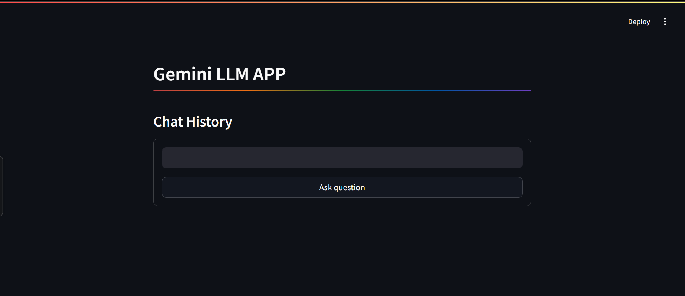
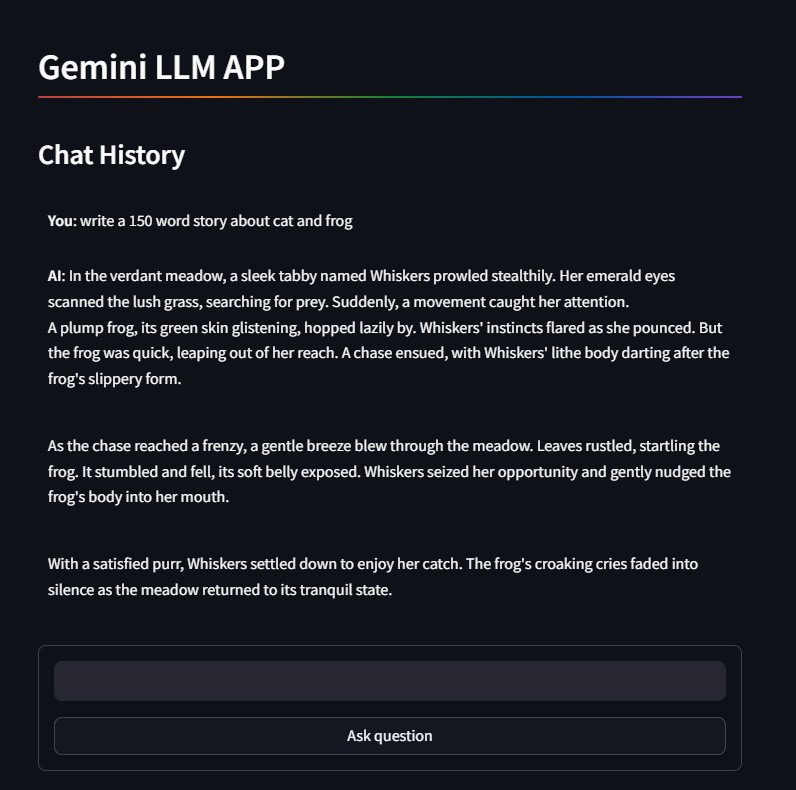

# Create an Environment for Running Your Application (Recommended)

**Type the Following command the terminal where you are going to create the application**

**`python -m venv myenv`**

**Activate Environmennt**

`myenv\Scripts\activate`

**Install the requirement Packages**

`pip install -r requirements.txt`

---

# Get Your Google Gemini API Key using your Google Account

How to get a Gemini API key, to know more[[Click Here](https://ai.google.dev/gemini-api/docs/api-key)]

Replace the your API key in .env file

`GOOGLE_API_KEY = '`

---

**To Run the Chat application**

`streamlit run app.py`

